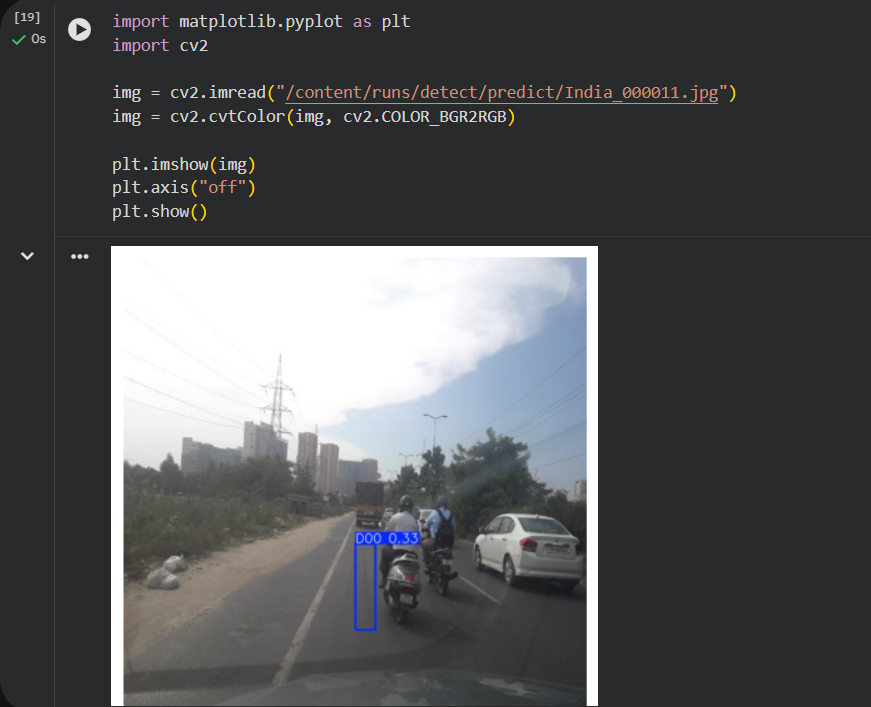
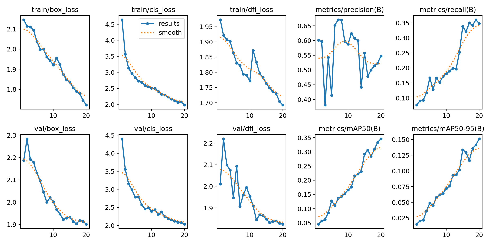
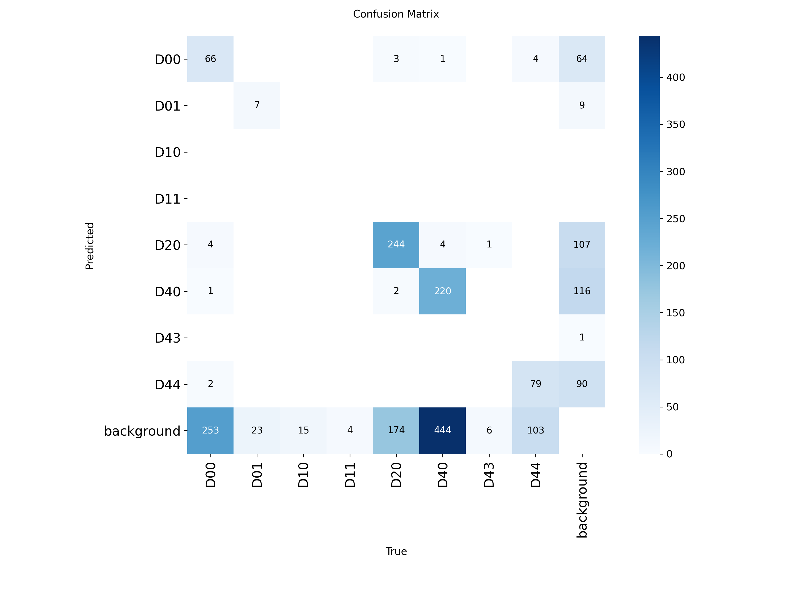

# Road Damage Detection Using YOLOv8

## Overview

This project detects road damages such as cracks and potholes using the YOLOv8 object detection model.

## Dataset

RDD2022 Road Damage Dataset

## Classes

- D00
- D01
- D10
- D11
- D20
- D40
- D43
- D44

## Technologies Used

- Python
- YOLOv8
- Google Colab
- OpenCV

## Training Configuration

- Model: YOLOv8n
- Epochs: 20
- Image Size: 640
- Batch Size: 16

## Sample Prediction

## Training Results

## Confusion Matrix

## Results

The trained model can detect multiple categories of road damage from road images.

## Future Enhancements

- Real-time detection
- Android application
- GPS-based reporting
- Smart city integration
